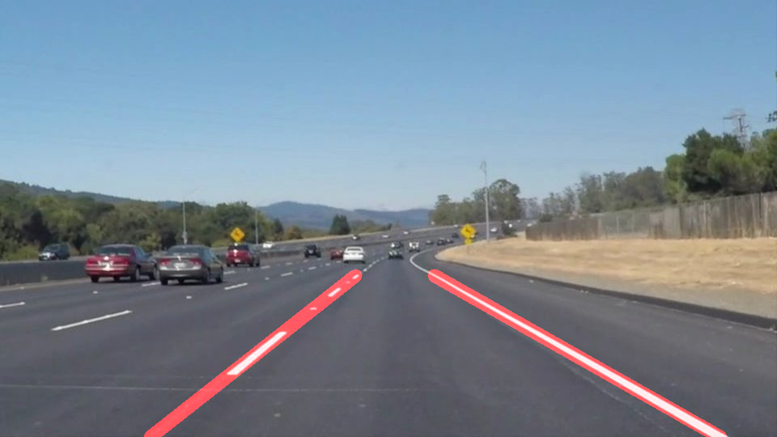
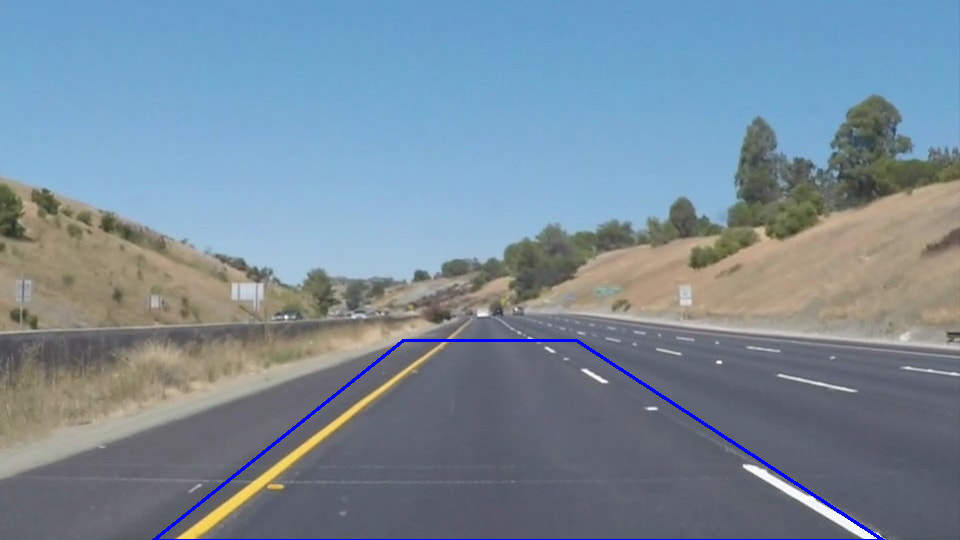
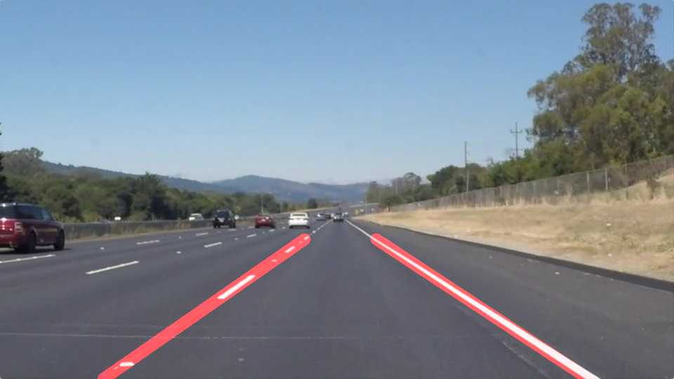
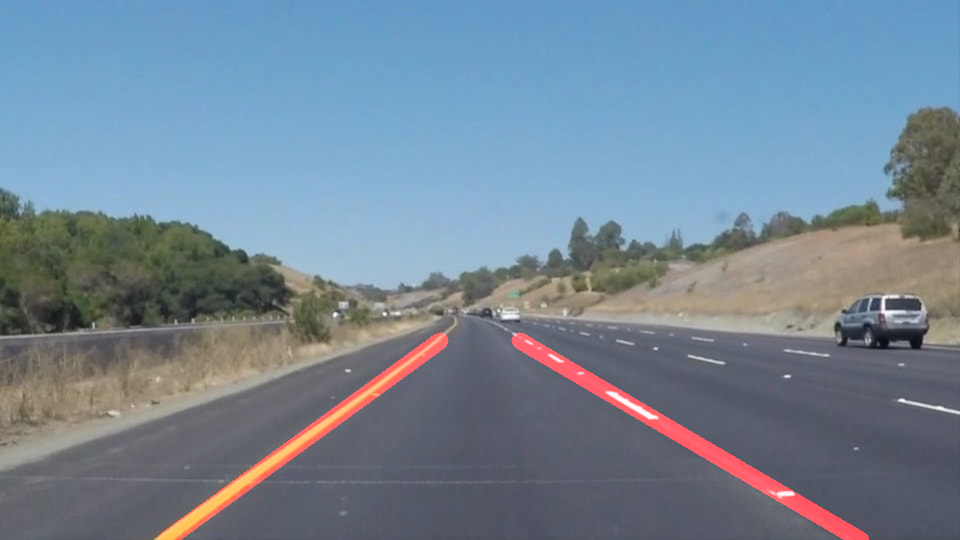
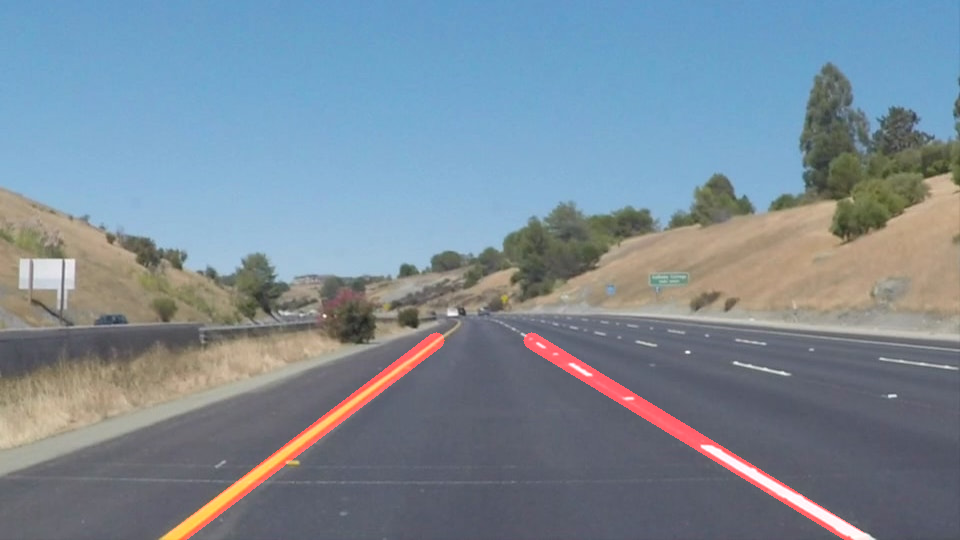
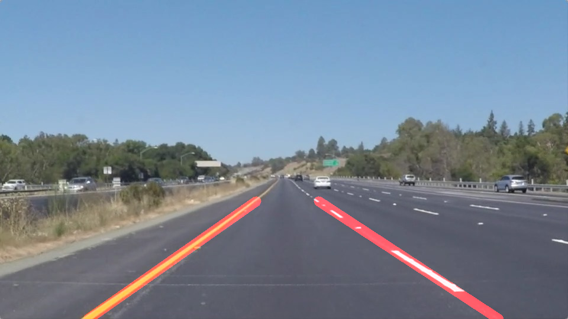
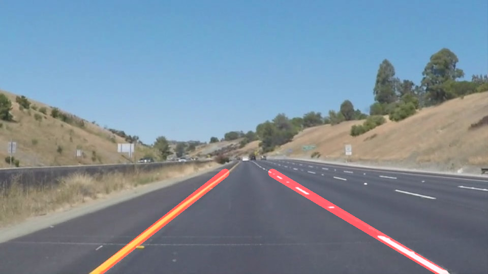

# **Finding Lane Lines on the Road** 

This project builds a computer vision pipeline to detect lane lines on roads.
The pipeline is then tested on images and video clips.

### Reflection

### 1. Image Processing Pipeline.
The input road images looked like shown below:

The intent of the pipeline is to detect and draw lane lines on the above image as shown below:

The following steps were taken by the pipeline:

#### a. Pipe Stage 1: Convert Color image to HSV Format & Extracting Yellow & White pixels. 
The first step is to convert the picture in a format which enables robust edge detection. Two different techniques were tried - converting color to Grayscale; converting color to HSV. It is noticed that processing the picture in HSV format yields more consistently robust results. Especially, when the image has lot of shadows and different road textures. HSV format made it easier to pick out pixels which are only Yellow or White - the color of road lane lines.
#### b. Pipe Stage 2: Edge Detection 
Canny Edge detection function has been used to detect sharp gradients and hence edges in the image obtained from Stage-1 i.e the image which has only white and yellow pixels. A 1:2 ratio of low-threshold to high-threshold with high-threshold selecting intensities above 150 and extending till low-threshold value of 50 was found to provide decent results on image inputs, however, these values did not perform too well on the solidYellowLeft video (present in ./test_videos). 50:150 made the pipeline quite vulnerable to the changing road tones and light traces of line segments present on the road which were not lane lines. Hence 100:200 was chosen as the low-threshold: high-threshold for Canny Edge Detection.
#### c. Pipe Stage 3: Gaussian Blurr
The edges detected from the above pipe-stage were smoothened by using Gaussian Blurr with a kernel size of 3.
#### d. Pipe Stage 4: Selection of Region of Interest from the road image.
The region of interest i.e the section of the image containing the road lanes was selected by analyzing the given input images and videos. With a fixed front viewing camera, the lanes are usually noticed in a trapezoidal region on the lower part of the frame. With some trial and error the region of interest was selected with the following vertices:
vertices = np.array([[(int(img.shape[1]*0.16),img.shape[0]), \
                      (int(img.shape[1]*0.42),int(img.shape[0]*0.63)), \
                      (int(img.shape[1]*0.6),int(img.shape[0]*0.63)), \
                      (int(img.shape[1]*0.92),img.shape[0])]], \
                      dtype=np.int32)

The above polygon is printed on the image below:

#### e. Pipe Stage 5: Detection of Line Segments 
The next step is to detect line segments from the edges present in the region of interest. Hough Transform is used to detect the end points of various line segments present in the trapezoidal area which form the lanes.
The hough space is formed by a rho of 1 pixel and theta of 1 radian resolution. After some trial and error, a threshold of 30 intersections per pixel and minimum line lenght of 100 and maximum line gap of 160 yielded the best and consistent results on image and video inputs. 

#### f. Pipe Stage 6: Draw lines
Hough transform from the earlier pipestage yielded sets of line-segment end points that were detected in the image (in region of interest). The draw_lines() function iterated through the sets of line-segments and does the following:
      (i).   All horizontal lines (y1==y2) and vertical lines (x1==2) should be ignored. 
      (ii).  For the remaining lines, compute slope m = (y2-y1)/(x2-x1)
      (iii). if slope is greater than 0.2, accumulate the slope in a variable m_left and intercept (c in y = mx + c) in a                            variable c_left and increment the number of line-segments detected on left lane (left_num++).
      (iv).  if slope is lesser than 0.2, accumulate the slope in a variable m_right and intercept (c in y = mx + c) in a variable                    c_right and increment the number of line-segments detected on right lane (right_num++).
The left and right slopes and intercepts are then averaged (m_left/left_num; m_right/right_num; c_left/left_num; c_right/right_num).
With the known slope and intercept values for left and right lane lines and known horizontal edges of the region of interest, the x coordinates for intersection are derived. 

For example the horizontal edges of region of intereset are the below lines:
y = img.shape[0]
y = int(img.shape[0]*.63)

The x-coordinate values for the point of intersection of above lines and the left-lane (assume y = mx+c) are then calculated as:
y2 = img.shape[0]
y1 = int(img.shape[0]*.63)
x2l = int((y2-cl)/ml)
x1l = int((y1-cl)/ml)
 ml and cl is the average of left-line slope and intercept.
 
 Similarly the point of interesection of the right-lane with the horizontal edges of region of interest are calculated. 
 
 Once the co-ordinates for the left and right lanes are derived, cv2.line funciton is used to draw the lane lines.
 
 #### g. Pipe Stage 7: Overlay the lines on the initial image
 The lines drawn above were then overlaid on the initial road image with weighted bit-wise AND  for partial transparency of lines to show the actual lane lines below.
 
 This yielded the final image outputs as below:

 
 
 
 
 
 
 
 
 
 

### 2. Shortcoming with the current pipeline

The region of interest scales with the size of the image, however the shape selection is not dynamic. When the lanes grow narrower or broader or if the frame captures some other part of the car it is mounted on, the fixed region selection will falter. 

Another shortcoming is the inefficiency of gradient-edge detection to detect lane lines in all conditions. For example, as seen in the challenge video, the road texture changes a lot and gradient edge detection of the grayscale image does not do justice in detecting lane lines.

### 3. Areas of improvement
The draw_lines function is an order(n) computation where n is the number of line segments detected by Hough Transform. 
It would be interesting to investigate less computationally intensive methods to do the same.

